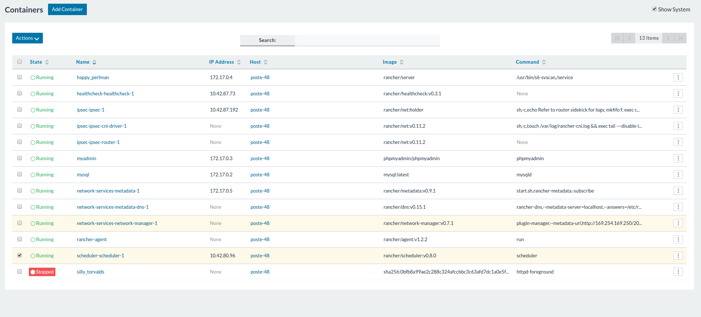
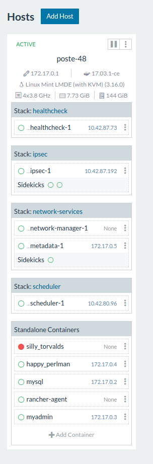
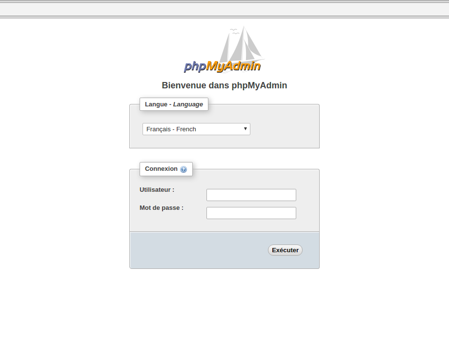
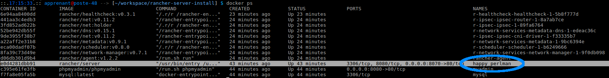
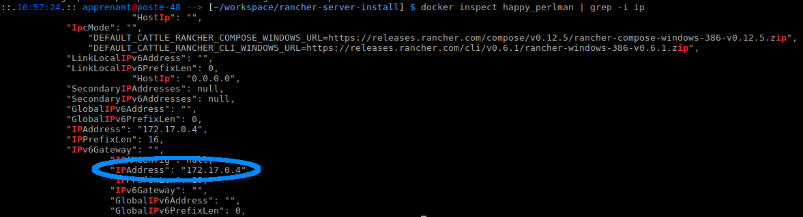

# A RancherOS enviroment installation script

Functional server architecture installer to your container environment with the following containers already installed :

* Apache2
* MySQL
* PhpMyAdmin
* RancherOS

## Installation manual

* On your terminal :

`git clone https://github.com/Yandevweb/rancher-server-install.git && cd rancher-server-install`

* Transform file to an executable :

 `sudo chmod +x install_rancher.sh`

* Launch the script :

`sudo ./install_rancher.sh`

* Choose your MySQL password (this will be your password to acces to PhpMyAdmin)

## Access adresses

* apache index: `localhost:4000`
* PhpMyAdmin: `localhost:8080`
* Access to Rancher (a particular workaround)
  * On your terminal :
    * check your `rancher/server` image name
      `docker ps`
      
    * here you can check your rancher adress
     ` docker inspect happy_perlman | grep -i ip`
    
    copy your adress and add the `8080` port
